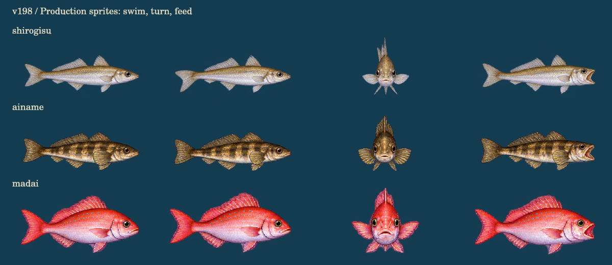
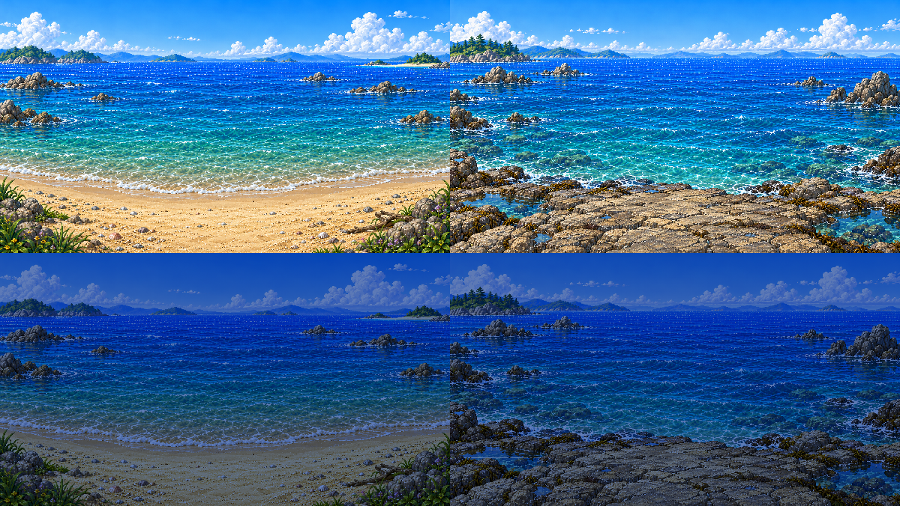

# v198 沿岸の釣り背景・魚・サイズ表示

2026-09-27。v197 の沿岸カヌーを維持し、残っていた沿岸キャスト背景とシロギス・アイナメ・マダイを更新。

| 素材 | 用途 |
| --- | --- |
| `assets/cast-coast-sand-v198.webp` | 砂島のキャスト背景 |
| `assets/cast-coast-reef-v198.webp` | 岩礁のキャスト背景 |
| `assets/fish-shirogisu-v198.webp` | シロギスの泳ぎ・旋回・口 |
| `assets/fish-ainame-v198.webp` | アイナメの泳ぎ・旋回・口 |
| `assets/fish-madai-v198.webp` | マダイの泳ぎ・旋回・口 |

画像は built-in ImageGen で制作。元画像から lossless WebP に変換し、RGBA 全画素の一致を確認。既存画像の上書きやプログラムでの魚の描き直しは行っていない。

魚のアトラスは4列×4行。読み順で泳ぎ8コマ、右→正面→左の旋回5コマ、閉口・半開口・開口3コマ。頭の基準点を各コマで測定し、描画時に位置を合わせる。マダイは初稿のヒレの余白不足を ImageGen で修正してから採用。水中の釣り、取り込み、釣果、図鑑、家の水槽、持ち歩き水槽が同じ描画経路を利用する。魚の当たり・引き・サイズ抽選・報酬は変更しない。

水槽の拡大表示は常時旋回から、横向きの遊泳と端での折り返しに変更。魚種ごとの既存の泳速・深さに合わせて尾の周期も変える。サイズランクを魚一覧・選択欄・詳細欄・拡大画面に表示し、選択マーカーだけ小さくした。タップ範囲44pxと動きを減らす設定は維持。

## 検証

- `node --test *.test.cjs` を `nushi-tsuri/tests` から実行し、208/208件が成功（2026-09-27）。
- `node coastal-fish-render-harness.cjs <output-directory>` で、本番の `drawFishAtlasFrame` と実際にデコードした WebP を使った描画を確認。
- 3魚種×16コマの透明な余白、尾の変化、頭位置、各画面の遷移、6サイズランクを検証。
- プレビューは本番の描画関数による出力。ブラウザー上の実プレイを撮影した画像ではない。
- 沿岸のA釣り、移動1回で体力2消費、上陸、セーブ復帰は既存の回帰テストを継続。

## 魚の参照資料

- [シロギス：新潟市水族館](https://www.marinepia.or.jp/picturebook/fish/entry-11427.html)
- [シロギス：四国水族館](https://shikoku-aquarium.jp/kannai/exhibition/creature/262.html)
- [アイナメ：新潟市水族館](https://www.marinepia.or.jp/picturebook/fish/entry-10924.html)
- [マダイ：桂浜水族館](https://katurahama-aquarium.note.jp/n/n084ff4b5a2b4)

## ImageGen プロンプト仕様

共通：premium Super Famicom era Japanese fishing RPG pixel art、細かいピクセルのまとまり、自然な陰影とヒレの条、単純な幾何学形状にしない。魚は実際のアルファ透過、背景は不透明。文字・UI・枠・透過を模したチェック柄を描かない。

シロギス：4 columns × 4 rows, sixteen equal cells, elongated silver-pearl body, pale sand-gold back, small pointed mouth, two delicate translucent dorsal fins, lightly forked tail. Row1 swim0–3; row2 swim4–7; row3 right side, right three-quarter, front, left three-quarter; row4 left side, right mouth closed, half open, open. Same scale and head position, one tail-beat loop, transparent padding. Canvas aspect 2:1.

アイナメ：シロギスのシートを画風と配置の参照とする。Anatomically distinct Hexagrammos otakii, sturdy elongated olive-brown and amber mottled body, irregular dark bands, long low dorsal fin, large rounded pectorals with fin rays, nearly straight tail edge. 同じ16コマ構成。シロギスの形を流用しない。

マダイ：シロギスのシートを画風と配置の参照とする。Pagrus major, deep laterally flattened coral-pink body, high spiny dorsal, silver-pink belly, forked red tail, tiny turquoise upper-flank spots, small stout mouth. 同じ16コマ構成。最終編集：keep the exact 4×4 order, identity, colors, anatomy and orientations; reduce each drawing to 78% within its own cell to provide transparent gutters; preserve all fins and all swim/jaw poses.

砂浜：既存 `cast-sea-beach-day-soft-v76.jpg` を画風参照。16:9, view from uninhabited sand island, bottom24% ivory sandy shore clear at the center for the player, turquoise shallows into cobalt sea, restrained fine wave glints, distant wooded islands, bright blue sky and cumulus. Open central casting space; no characters, boats, rods or UI.

岩礁：既存の海辺と今回の砂浜を画風・色の参照とする。16:9, bottom24% flat tide-worn gray-brown rocky ledge with dimensional cracks and wet edges, pools at corners, clear central standing space, teal reef shallows into cobalt open water, rock stacks at the sides, pine-covered distant island. Open central casting space; no characters, fish, boats, rods or UI.

## 実機からの残件（今回の変更対象外）

1. 河口ルートから乗り物店の入口へ向かうと、見えない当たり判定で通れない。経路全体を再現して修正する。
2. 村の左端から主人公宅へ移動した際、家側の左から出現して接続方向が逆になる。村からの進行方向と家側の入口・出口を一組で確認する。
3. 水槽の背景がのっぺりしている。ガラス越しの奥行き、砂利、岩、水草を既存の精密ドット絵に合わせる。
4. ブラックバスを含む既存魚の尾・ヒレの素材更新。今回の絵の新規制作は沿岸3魚種。拡大画面の往復運動だけで既存の尾素材の問題が完了したとは扱わない。

今回ユーザーが最優先に指定した沿岸とその魚を先に仕上げる。上記の実機不具合を解決済みとは扱わない。
