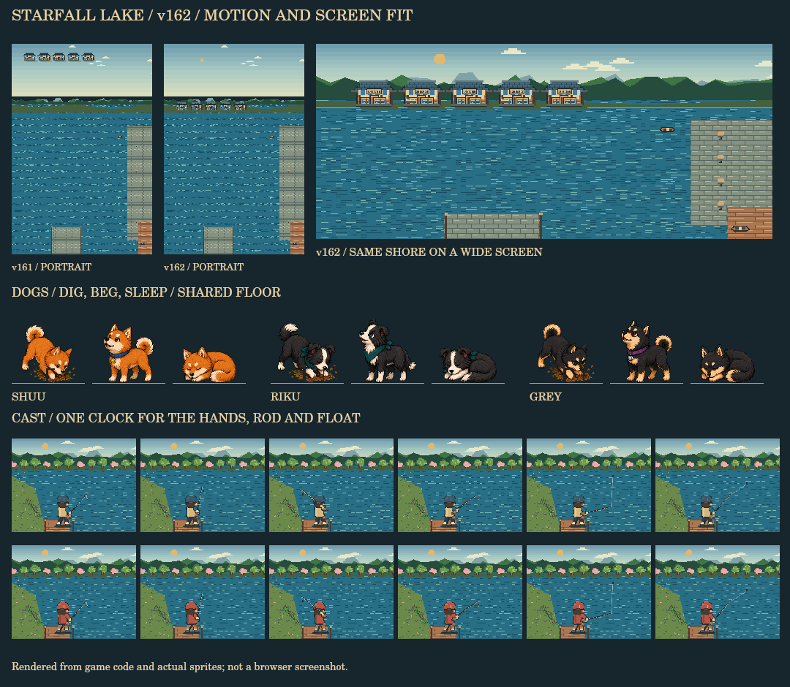

# 星降る湖 v162：景観と動きの仕上げ

v161を点検し、再現できたキャスト・犬・画面比率の不具合を修正した。

この画像は実際の描画コードと既存の犬素材から作った確認用合成。ブラウザやスマホ実機のスクリーンショットではない。

## 修正内容

- キャストの描画を、従来の120msごとのゲーム進行処理から分離。投げる1.2秒の間だけ、最大30fpsで描画する。手・竿・ウキは同じ経過時間を参照し、背景は再描画しない。
- 画面描画コールバックの経過時刻を、投げ始めの日時と誤って引き算していた箇所を解消。着水・釣り終了・ページ非表示で描画ループを停止し、重複起動を防ぐ。
- ウキが竿から離れる瞬間に約9px跳ぶ不具合を修正。ぶら下がっていた実際の位置から飛び始める。
- 着水直後だけ糸の曲線が変わる処理を統一。次の更新で糸が跳ねないようにした。
- フィールドの犬が眠る・おねだりする際、古い中央基準のアニメーションで足元が移動する不具合を修正。足元を固定し、犬の絵だけを穏やかに伸縮させる。左右反転と「動きを減らす」設定にも対応。
- シュウ・リク・Greyの穴掘り／おねだり素材の透明な下余白を補正。穴掘りの前足も同じ補正で描く。
- 港の遠景建物が、縦画面で岸から離れて空中に浮く配置を修正。画面の高さから岸の位置を求める。
- v162の表示とキャッシュを更新。HTMLが読み込む描画モジュールと、オフラインキャッシュのURLが一致することを検査する。

なでる表示の縦横比はv161ですでに対応済みだったため、変更していない。マップの通路・衝突判定、釣果や餌の消費、一投10分、既存セーブ形式も変更していない。

## 主なファイル

| ファイル | 変更 |
| --- | --- |
| `index.html` | キャスト描画の開始・停止、糸の同期、犬の足元補正、バージョン |
| `pixel-cast.js` | ウキを放す瞬間の位置の連続性 |
| `pixel-scenes.css` | 犬の足元と向きを保つ待機アニメーション |
| `pixel-world.js` | 画面比率が変わっても岸に接地する港の建物 |
| `sw.js` | v162キャッシュ |
| `tests/pixel-polish.test.cjs` | 今回の不具合を再現する5件のテスト |
| `tests/pixel-world.test.cjs` | モジュールとキャッシュURLの一致検査 |

## 検証

修正前に追加5件が失敗することを確認し、修正後は通過した。既存テストを含む全37件が通過。最後に待機姿勢から歩き出す時も正しい歩行用の足元になるよう補正し、今回の5件と既存の犬テスト5件を再実行して全10件が通過した。

キャストの中間フレーム・非表示と復帰・着水・キャンセル・餌消費、ウキの連続性、犬3匹の実素材による足元、横／縦画面の港を検査。既存の家の通路と家具・水槽・料理・犬・図鑑・掲示板・セーブ／ロード・魚と針の同期・キャッシュの検査も通過した。24景観×4季節×5時間帯の480通りも引き続き描画できる。

確認範囲で未解決の不具合はない。ブラウザ実描画・スマホ実機の操作感・実測フレームレートは未確認。
