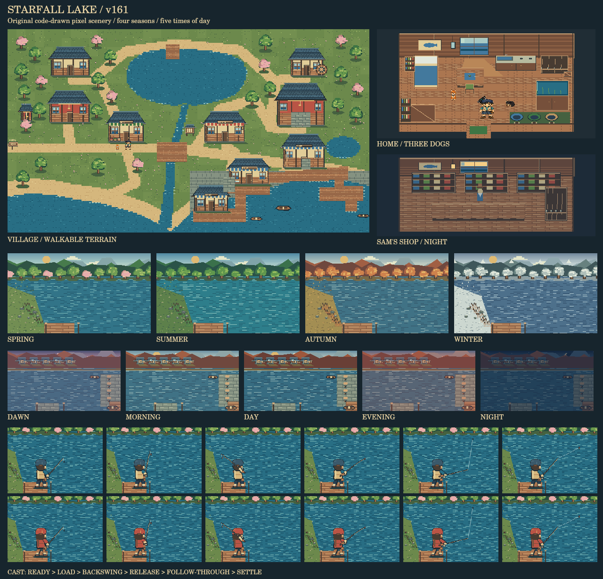

# 星降る湖 v161：ドット絵の景観とキャスティング

村、建物、道、湖、小川、砂浜、船着場、サムの練習池、主人公宅の内外、各施設の店内、水中を、共通のドット絵部品で描画する構成へ変更した。景観に既製の一枚画像を貼る方式は使用していない。既存の魚・犬・歩行主人公の素材は再利用する。

この画像はゲームの描画コードと実素材から作った確認用合成。ブラウザやスマホ実機のスクリーンショットではない。

## 景観

`pixel-world.js` は、床・瓦屋根・柱・窓・木・草・石・木箱・桟橋・家具などを整数ピクセルで描く。装飾の配置には独立した固定ハッシュを使い、釣果や採集の乱数を消費しない。メインマップの水域・橋・建物は既存の地形データを描画に利用し、主人公宅の家具は描画と衝突判定で同じ配置データを使う。

| 時間帯 | ゲーム内時刻 |
| --- | --- |
| 明け方 | 04:00〜05:59 |
| 朝 | 06:00〜09:59 |
| 昼 | 10:00〜16:59 |
| 夕 | 17:00〜18:59 |
| 夜 | 19:00〜03:59 |

四季は春→夏→秋→冬、それぞれ30日、120日で一巡する。春の花、夏の緑、秋の紅葉、冬の積雪、時間帯の空と窓の明かり、水の色を変える。ゲームを開始した日を春1日目とし、既存セーブは保存されている総経過日から季節を算出する。

セーブ形式は変更せず、`gameMinutes`から季節・時間帯を復元する。釣果・採集が使う既存の4時間帯の確率表は維持し、景観用の明け方を追加している。今回は季節による魚種・採集品・価格の変更や天候機能は追加していない。

背景は時間・季節・エリア・表示サイズが変わった場合だけ描き直す。毎回の移動やキャスト動作でマップ全体を再生成しない。旧景観・旧キャスト画像を事前キャッシュの対象から外し、3つの描画用コードファイルを追加した。

## 主人公と投げる動き

`pixel-cast.js`で男女それぞれの後ろ姿を描き、構え→振りかぶり→振り抜き→着水までを1.2秒の共通時刻で制御する。両足を接地したまま体重を移し、両手・竿・リール・竿先・飛ぶウキを同じ座標系で計算する。糸の始点は描画した竿先と一致し、ウキは選択した投点へ着水する。5本の既存竿の選択も引き継ぐ。

フィールドの人物・犬・なでる表示の大きさをマップに合わせ、足元の基準を揃えた。港では、舟具屋と東側桟橋へ渡る通路の途切れを修正した。

## 変更ファイルと検証

- `index.html`：景観組み込み、地形接続、時計表示、キャストと既存UIの接続。
- `pixel-world.js`：共通部品、24種類の景観、4季節×5時間帯。
- `pixel-cast.js`：男女の人物・竿・飛ぶウキの一体描画。
- `pixel-scenes.css`：Canvas表示、人物の縮尺、旧背景レイヤーの整理。
- `sw.js`：v161キャッシュと新モジュール。
- `tests/`：ローカルモジュールを読み込むハーネス、景観・地形・キャスト検査。

自動テスト32件が通過。実際のCanvas描画で24景観×4季節×5時間帯の480通りを検査し、男女×5本の竿×3画面比率の動作と着水点を確認した。既存の家への出入り、水槽、釣り、料理、犬、図鑑、掲示板、セーブ／ロード、キャッシュに関するテストも通過している。

検証範囲で未解決の不具合はない。ブラウザ実描画とスマホ実機での表示・操作感・初回描画性能は未確認。
