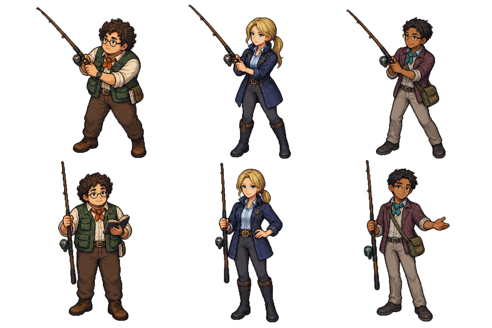
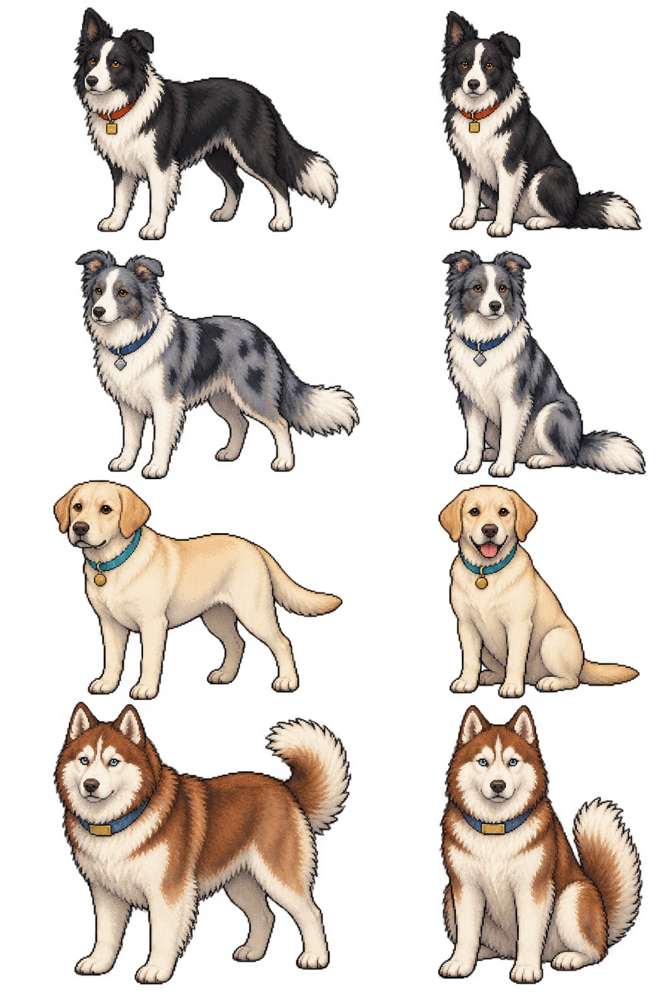

# 星湖の名手と相棒犬 — デザイン・実装資料 v179

今回の新規制作はリアオ、アスアル、ダンサーの3人と、クロー、クラウド、ジェイミー、チャッピーの4匹。サミュエル・オールドマン本人は既存の画像・帽子・サングラス・服装をそのまま使用する。

## 1. リアオ・ダモディ

| 項目 | デザイン |
| --- | --- |
| 性格 | 理屈派で慎重。効率と再現性を重んじる。自信はあるが、負けた結果も認めて記録する。犬と魚にはやさしく、手帳の余白まで使う几帳面さに愛嬌がある。 |
| 見た目 | 丸メガネ、濃茶の天然パーマ、やや小太りな成人男性。丸い頬と、考えるときの鋭い目を両立する。 |
| 服装 | 象牙色の袖まくりシャツ、深緑の釣りベスト、焦茶のパンツと実用的なブーツ。朱橙の小さなスカーフ。腰に計測手帳と整頓した道具袋。 |
| 配色 | 主色：深緑 `#355640`。補助：象牙 `#E8DFC5`、焦茶 `#554335`。差し色：朱橙 `#B86736`。 |
| シルエット | 丸い髪、丸い胴、四角いポケットと手帳。「丸」と「四角」を重ねた、低く安定した構え。 |
| 釣りスタイル | 精密・安定型。エサや深さを一つずつ変えて比較し、良い条件を見つけたら繰り返す。 |
| 大会での強み | 一匹の奇跡に頼らず、大きさのそろった五匹で高い合計を作る。相手から見ると崩れにくい。 |
| 主人公から見た印象 | 「少し口うるさいけれど、言っていることは的確。気づくと五匹そろっている、手強い人」。 |
| サムとの関係 | 釣りの持論では犬猿の仲。サムの経験と勘にリアオが記録と検証を要求し、二人とも譲らない。互いの犬や周りの人へ敵意を向ける関係にはしない。 |
| ドット絵の要点 | 髪の大きな丸い塊、丸メガネの二つの輪、横に広い胴、朱橙の首元、四角い手帳を残す。髪の一本一本や細かなポケットは省略できる。 |
| 立ち絵ポーズ | 釣り：足を広げ、短い竿を両手で一定の角度に保つ。会話：竿を立て、片手の手帳に目を落としてから相手を見る。将来の店員姿：手帳を小さな仕入れ帳に持ち替えられる。 |

セリフ例：

1. 「一匹の偶然より、五匹の再現性だ。さあ、条件をそろえよう。」
2. 「サムの『長年の勘』か。数値にしてくれれば検討できるんだがね。」
3. 「君の優勝だ。再現できる腕前だった。次は僕の手帳に、対策を増やそう。」

### 相棒犬：クロー

| 項目 | デザイン |
| --- | --- |
| 見た目 | 引き締まったボーダーコリー。細い白い額筋、鋭い琥珀色の目、白い胸毛。片耳の先が折れ、長い飾り尾は低く保つ。 |
| 毛色 | 黒×白。背中は大きな黒い一枚の塊。白い額・胸・足先との明暗で読ませる。 |
| 識別ポイント | 朱橙の首輪と、四角い真鍮の迷子札。リアオの首元の色とつながる。 |
| 性格 | 賢く観察力が高い。合図を待てる仕事上手。落ち着いているが、必要なときは反応が速い。 |
| 飼い主との相性 | リアオの細かな手順を理解し、焦りを察すると静かにそばへ寄る。理屈と観察の組み合わせ。 |
| ドット絵の要点 | 大きな黒い背中、白い胸、片耳の折れ、橙の首輪。細い白毛を増やしすぎず、クラウドのまだら模様と混同させない。 |

## 2. アスアル・マダケン

| 項目 | デザイン |
| --- | --- |
| 性格 | クールで理知的。自他に公平で、勝負には誠実。相手を見下さず、勝ったときも負けたときも判断の良さを言葉にする。 |
| 見た目 | 金髪を低い位置でまとめた、すらりとした成人女性。凛々しい目と、乱れの少ない立ち姿。 |
| 服装 | 太もも上までの濃紺の釣りジャケット、淡い氷青のシャツ、細身の炭灰のパンツ、膝下の実用ブーツ。腰の細いベルトと小さな銀の留め具。 |
| 配色 | 主色：濃紺 `#253D60`。補助：氷青 `#BBCFD8`、炭灰 `#414550`。金髪 `#D8B96D` と銀 `#BFC8CE` が光を受ける。 |
| シルエット | 頭から脚へ続く長い縦線。小さくまとめた髪、細い腰、丈のあるジャケットで、リアオの丸い形と対照を作る。 |
| 釣りスタイル | 選別・大物型。小さな反応をすべて追わず、大型がいる深さや間合いを選ぶ。 |
| 大会での強み | 一匹のサイズが大きく、最大魚による同点判定にも強い。匹数が少ない展開もあるが、大物で一気に合計を伸ばす。 |
| 主人公から見た印象 | 「立っているだけで上手そう。厳しい勝負になるけれど、勝てたらきちんと認めてくれる人」。 |
| ドット絵の要点 | 明るい金髪と濃紺の縦長の胴を最優先。細かな銀の留め具より、低い結び髪とまっすぐな姿勢を残す。 |
| 立ち絵ポーズ | 釣り：背筋を伸ばし、竿先を静かに保つ。会話：竿を垂直に立て、片手を腰に添える。将来の店員姿：同じ姿勢で釣具を一本掲げれば、道具を説明する姿になる。 |

セリフ例：

1. 「運も勝負のうち。でも、準備まで運任せにはしないわ。」
2. 「良い勝負にしましょう。私も、最後の一投まで譲らない。」
3. 「優勝おめでとう。あなたの判断も、最後の一投も見事だったわ。」

### 相棒犬：クラウド

| 項目 | デザイン |
| --- | --- |
| 見た目 | しなやかで細身のボーダーコリー。半立ちの耳、長い飾り尾、白い胸。足をそろえて止まる姿も軽やか。 |
| 毛色 | ブルーマール×白。銀に近い青灰色を土台に、大きめの濃灰のまだらを数個配置する。 |
| 識別ポイント | 濃紺の首輪と、ひし形の銀の迷子札。アスアルのジャケットと銀の留め具につながる。 |
| 性格 | 上品で俊敏。周りをよく見て、飼い主が竿を振る場所を空けられる。 |
| 飼い主との相性 | 無駄のない動作と静かな合図で通じ合う。アスアルの集中を妨げず、呼ばれたらすぐ反応する。 |
| ドット絵の要点 | 青灰色の面と少数の濃灰の斑を残す。細かい点々にすると縮小時に灰色へつぶれるため、模様は大きくまとめる。クローの黒い背中とは面構成から分ける。 |

## 3. ダンサー・イチャピ

| 項目 | デザイン |
| --- | --- |
| 性格 | 温和で場を和らげる。力まず話すが、勝負で手を抜かない。状況に合わせて変えることを、弱さでなく技術と考える。 |
| 見た目 | 短髪、細い長方形のメガネ、痩せ型、少し濃い肌の成人男性。中性的で柔らかな雰囲気。 |
| 服装 | 袖をまくったくすみ紫の短いジャケット、淡い灰のシャツ、小さな青緑のスカーフ、砂灰のパンツ。薄い斜め掛けの道具袋。 |
| 配色 | 主色：くすみ紫 `#745365`。補助：砂灰 `#B5AA93`、温かい肌色 `#AA754F`。差し色：青緑 `#4A969B`。 |
| シルエット | 細い胴と長い手足。片脚に少し重心を寄せ、斜め掛けの線と開いた片手で軽い非対称を作る。アスアルの直立した対称形と分ける。 |
| 釣りスタイル | 対応・入れ替え型。反応を見て少しずつ修正し、釣る技術とビクを選ぶ判断を両立する。 |
| 大会での強み | 手数が多く、五匹がそろった後も入れ替えで伸ばす。後半の合計上昇を警戒したくなる相手。 |
| 主人公から見た印象 | 「一緒にいて安心するのに、勝負になると隙がない。最後まで順位を確認したくなる人」。 |
| ドット絵の要点 | 短い髪、細いメガネ、紫の短い上着、青緑の首元、斜め掛けの線。細かな表情が見えなくても、力の抜けた姿勢で性格が残る。 |
| 立ち絵ポーズ | 釣り：肘を柔らかく使い、腰を少し落とした構え。会話：竿を立て、空いた手のひらを軽く開く。将来の店員姿：同じ手で道具や商品を示せる。 |

セリフ例：

1. 「肩の力は抜こう。でも勝負は、最後まで本気でいくよ。」
2. 「五匹そろってからが面白い。何を残すかで、同じ釣果も変わるから。」
3. 「優勝おめでとう！ 最後まで丁寧だったね。気持ちのいい勝負だったよ。」

### 相棒犬：ジェイミー

| 項目 | デザイン |
| --- | --- |
| 見た目 | 短毛のラブラドール。丸い垂れ耳、広い口元、やさしい目、太くまっすぐなオッターテール。コリーより胴に厚みを持たせる。 |
| 毛色 | クリーム寄りの白。耳と背中は少し温かいクリーム色、胸と足先は明るい象牙色。 |
| 識別ポイント | 青緑の首輪と、丸い真鍮の迷子札。ダンサーのスカーフと同じ色系統。 |
| 性格 | 穏やかで親しみやすく、合図に素直。うれしさをゆっくりした尾の動きで表す。 |
| 飼い主との相性 | 相手を急かさない組み合わせ。ダンサーが周囲を和ませ、ジェイミーが足元の空気まで柔らかくする。大会では静かに待てる。 |
| ドット絵の要点 | 垂れ耳、短い毛、太い低い尾、明るい胴、青緑の首輪。白を一色にせず、耳と背中に一段だけ暖色の影を置く。 |

## 4. サムの相棒犬：チャッピー

| 項目 | デザイン |
| --- | --- |
| 見た目 | 風格のある成犬のハスキー。厚い胸、二つの立ち耳、白い左右対称の顔模様、落ち着いた青い目。ふさふさの尾を高く緩く曲げる。 |
| 毛色 | 赤茶×白。頭と背に銅色から深い赤茶、顔・胸・腹・脚は白。サムの渋い服の隣で温かい色が映える。 |
| 識別ポイント | 鋼青の太い首輪と、横長の真鍮プレート。長く使われた丈夫な道具のような印象。 |
| 性格 | 頼れて落ち着いている。必要以上に騒がず、サムの呼び声には耳や尾で反応する。店番の風格がある。 |
| 飼い主との相性 | 長い付き合いを感じる組み合わせ。サムが勝負や口げんかに熱くなっても、チャッピーはゆったり構える。 |
| ドット絵の要点 | 白い顔のマスク、二つの立ち耳、大きな胸、高い房尾、鋼青の首輪。赤毛の豆柴とは、体格・顔模様・胸毛で明確に分ける。 |

サム本人は既存の緑系の帽子、サングラス、白いひげ、濃い青のシャツ、黄土色の釣りベスト、オリーブのパンツを保持する。チャッピーの座り姿を店内のそばに配置し、サムの既存画像を描き直さない。

## 4人＋4匹の全体バランス

| 組み合わせ | 人の形・色 | 犬の形・色 | 並べたときの印象 |
| --- | --- | --- | --- |
| サム＋チャッピー | 帽子・ひげ・横に安定した姿。黄土とオリーブ | 厚い胸・立ち耳・高い房尾。赤茶と白 | 長年の経験と、頼れる店番の風格 |
| リアオ＋クロー | 丸い天然パーマと胴。深緑と朱橙 | 細い額筋・片耳の折れ・低い飾り尾。黒白 | 緻密な計画と、鋭い観察の組み合わせ |
| アスアル＋クラウド | 金髪・長い縦線。濃紺と銀 | しなやかなコリー。青灰色の大きな斑 | 洗練、静かな集中、すばやい判断 |
| ダンサー＋ジェイミー | 細身で非対称の構え。紫と青緑 | 垂れ耳・短毛・太い低い尾。明るいクリーム | 親しみやすさと、力まない確かな技術 |

### 見分けやすさと色被り

人は「帽子とひげ／丸い巻き髪／金髪の縦長／短髪の細身」を第一の識別手段にする。サムとリアオには自然になじむ緑系があるが、サムは黄土ベスト、リアオは深緑ベストと橙の首元で分ける。アスアルの濃紺とダンサーのくすみ紫も、金髪と黒髪、長い上着と短い上着で区別できる。

同じ犬種のクローとクラウドは、黒い一枚の背中と青灰色の斑で分ける。全員に白い毛があるため、毛色だけでなく耳・尾・体格を必ず残す。首輪と札の組み合わせは、橙＋四角／紺＋ひし形／青緑＋丸／鋼青＋横長。色が判別しにくい表示でも形が補助になる。

### 大会NPCとしての見せ方

3人のライバルは、全員を同じ「高い数値の相手」にしない。リアオは安定した合計、アスアルは大きな最大魚、ダンサーは後半の入れ替えで強さを見せる。犬は道具や竿の線に重ねず、飼い主の外側に置く。主人公から話しかける通路を残す。

ゲーム内では主人公＋名手3人の4人で競う。サムは主催者として店に残り、チャッピーがそばで待つ。通常の村人4人とのフナ大会は別の選択肢として残る。

### 簡略化しても残す要素

| 対象 | 最低限残す要素 |
| --- | --- |
| リアオ | 丸い髪、丸メガネ、幅のある胴、橙の首元、手帳 |
| アスアル | 金髪、低い結び髪、濃紺の長い上着、まっすぐな構え |
| ダンサー | 短髪、細いメガネ、細身、紫の短い上着、開いた片手 |
| クロー | 黒い背中、白い胸、片耳の折れ、橙の首輪 |
| クラウド | 青灰色の地、少数の大きい濃灰斑、紺の首輪 |
| ジェイミー | 垂れ耳、短毛の明るい胴、太い低い尾、青緑の首輪 |
| チャッピー | 白い顔模様、立ち耳、厚い胸、高い房尾、鋼青の首輪 |

小物を削る場合は、細かなポケット、留め具、毛の一本一本から省略する。人物の体型、犬の耳と尾を同じ形へそろえない。

## v179で遊べる内容

- 普段の湖の東岸にリアオとクロー、南東岸にアスアルとクラウド、南西岸にダンサーとジェイミーが登場。向き合ってAで会話できる。
- サムの店先と店内にチャッピーが登場。店内の「チャッピーに挨拶」からも会える。店内会話を閉じると店へ戻る。
- サムの店に「名手と相棒犬の紹介」を追加。4組を絵と紹介文で見比べられる。
- 大会受付で「星湖フナ大会」と「星湖名手挑戦」を選択。名手挑戦は3,000円、90分・9投、フナ最大5匹の合計。賞金・エサは通常大会と同じ。初優勝は専用の星湖名手杯。
- 大会中・終了後の順位や釣果に応じて、3人それぞれの会話が変わる。顔付きの会話欄は画面下に表示する。
- 普通の村人大会中は、その参加者へ湖畔の立ち位置を譲る。名手挑戦では名手と相棒犬が会場に残る。
- 主人公の同行犬の選択や所持品には加えず、それぞれの飼い主の相棒として登場する。

| 名手 | 9投中の対象魚 | 1匹のサイズ | 最終ビクの合計 | 挙動 |
| --- | --- | --- | --- | --- |
| リアオ | 5〜7匹 | 22〜34.5cm | 125〜144cm | 狭めの合計範囲で安定 |
| アスアル | 4〜6匹 | 24〜41cm | 132〜169cm | 大型中心、合計の変動は大きめ |
| ダンサー | 6〜8匹 | 21〜36cm | 120〜153cm | 後の釣果ほど大きくなり、入れ替えで伸ばす |

釣果計画は参加時に保存し、プレイヤーの成績を見て後から強くしない。相手の成績は主人公が終えた投数までだけ表示する。大会別に優勝回数と成績を保存し、既存のフナ大会の記録を引き継ぐ。

ショップ店員への転用、新しい魚種・会場、専用BGM、歩行アニメーションは今回の追加範囲に含めていない。立ち絵と会話データを分けたため、後から役割を増やせる。

## 動作確認

関連する自動テスト81件が成功。名手の釣果計画1,000通り、7人・匹への接近と会話、参加費の一度だけの支払い、9投目の入れ替えと途中再読み込み、賞品の重複防止、大会別記録の引き継ぎを確認した。既存の港の通路、画面下の会話欄、魚の描画、天気、犬との暮らしも回帰確認に含む。

実際の描画処理で人物6ポーズ・犬8ポーズと顔7点を描き出し、透明部分、切り出し、縮小時の見分けやすさを確認した。Android実機での操作確認はこの自動テストには含まない。

## 原画と制作記録

組み込みの画像生成で制作した原画を使用。制作プロンプトは [art-prompts-v179.md](art-prompts-v179.md) に保存。既存のサムは `assets/sam-front.png` をそのまま使用する。

- 人物：`assets/rival-anglers-v179.png`。1536×1024、3人×釣り・会話の2ポーズ、透過PNG。
- 犬：`assets/rival-dogs-v179.png`。1024×1536、4匹×立ち・座りの2ポーズ、透過PNG。
- 実装：`rival-anglers.js` に人物・犬・会話・配置・切り出し範囲を集約。原画は改変せず、描画時に必要なポーズと顔を選ぶ。

