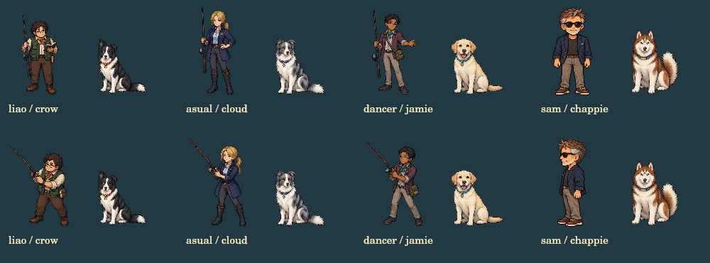

# v199 サミュエルの新しいドット絵

2026-09-28（日本時間）。承認済みのサミュエル設定画を、既存キャラに寄せた3方向のドット絵としてゲームへ組み込む。

## 表示

- 前髪の先の小さな跳ね、白いもみあげ、サングラス、短い白ひげを維持。
- 柔らかな紺のジャケット、暗いシャツ、灰褐色のパンツ、茶色い靴、青い胸元の布。
- 店内・大会受付・途中経過・結果・人物紹介・会話用顔画像が、同じ新しい素材を参照する。
- 大会・紹介では既存NPC共通の96×128描画枠と足元基準を維持。店内は従来の位置と142×292の表示枠、カウンターのマスクを維持する。
- 正面は挨拶、横向きは大会中の表示に使用。後ろ姿も素材に保存してあるが、今回の画面には追加しない。
- 人物紹介文の帽子・釣りベストの記述を、新しい外見に合わせて更新。

## 素材と制作方法

| ファイル | 内容 |
| --- | --- |
| `assets/sam-sprites-v199.webp` | 1536×1024、正面・右向き・後ろ姿の透過アトラス |
| `rival-anglers.js` | 実測した全身・顔の切り出し範囲と、横向きの左右反転 |
| `tests/samuel-render-harness.cjs` | 店内の実際のSVG座標とマスクで描画を確認する補助プログラム |

組み込みの ImageGen で制作した「サミュエルの3面図ドット絵」を使用。設定画を人物・服装の基準、旧サムと主人公をドットの密度・頭身・立ち姿の参考とした。実在人物の顔の再現は行わず、元のオリジナルキャラクターの外見を使用する。PNGからlossless WebPへ変換し、RGBA全画素の一致を確認。輪郭や色のプログラムによる描き直しは行っていない。

採用素材のプロンプト仕様：

> Detailed Super Famicom Japanese fishing RPG pixel art. Adapt the approved original elderly Samuel to the existing characters' compact game proportions, crisp small pixel clusters, warm subdued palette and layered material shading. Preserve short tousled brown-and-silver hair with a small raised front tip, silver temples and stubble, dark sunglasses, soft charcoal-navy blazer, slate shirt, taupe trousers, brown deck shoes and a small faded-blue pocket cloth. Create three head-to-toe views at a consistent scale and baseline: true front, right-facing side and back. Genuine alpha transparency; no scenery, labels, props or ground shadows. Original fictional face, visibly elderly, no recognizable real-person likeness.

## 確認

- 全回帰テスト209/209件成功。
- 受付→大会中→結果→人物紹介、チャッピーとの組み合わせを確認。
- 透過、全身の収まり、足元基準、左右反転、正面の非反転を実デコード画像で検証。
- 下の比較は本番のNPC描画関数による出力。ブラウザーの実プレイ写真ではない。
- 店内は実際のSVGに記載された切り出し範囲・表示枠・カウンターのマスクで合成して目視確認。
- 釣り・沿岸カヌー・体力消費・ショップ購入・大会進行・セーブ処理は変更していない。

乗り物店への通路、主人公宅へのマップ接続、水槽背景、他魚種の素材更新は別の残件。この更新で修正済みとは扱わない。
