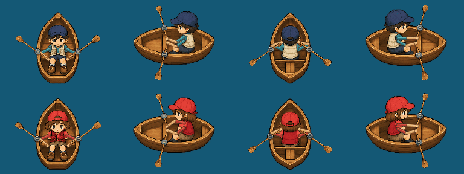

# v226 — 支点で動くオールと手

主人公の姿勢だけが変わり、オールが動かないように見えるという報告を受け、ボートの漕ぎを部品ごとの描画にした。二枚の完成絵の差を、ブレードが動いて見えることの代用にしない。

- 舟・帽子・顔・胴体は固定した詳細な画像を使う。二本のオールは舟の反対側の固定した支点で回る。
- 各オールの内側の柄から、その柄を握る手の位置を計算する。肩・肘・手をつなぎ、別々の手で一本ずつ握る。奥側のオールは外側を船体の奥、内側の柄を船内に描く。
- 8段階・720msの一周期で、前へ戻す、引く、引き切る、戻す動きを行う。一入力でも745msまで描画し、最後は回復した姿に静止する。連続移動中は周期を引き継ぐ。
- 男女・四方向の八つの船体と共通の一本オールを、組み込みImageGenで透明な部品画像にした。腕・手・支点の接続と運動はCanvasで描画する。
- 本番アセット: nushi-tsuri/assets/coast-rowboat-v226.png、1434×1097 RGBA、1,306,236 bytes、SHA256 401a951314e73a9db33e04a7dde2cf83e5b2cb895481084d057a51e29fa83863。
- 生成元: /workspace/scratch/9cd039af695f/generated_images/exec-b33af58c-a95f-4e3d-b56a-cba3c7a4c1eb.png。出力をそのままコピーし、PNGの背景や画素を加工していない。
- HUD v226、沿岸モジュールとService Worker 226-1、cache nushi-tsuri-v226-rowboat-motion-226-1。新PNGをオフライン用に含める。
- 装備保存ID canoe、価格3500円、一移動5・体力2・2分、タライのv224画像・操作、徒歩の歩行周期は既存のものを使う。

## 動きの確認

次のGIFは本番の描画関数・本番素材を192×144の船体Canvasで8段階・720msとして再生したもの。上が男、下が女、左から上・右・下・左。実入力の時間系列はブラウザ検査で別に記録する。



ローカルの実画像検査は七項目すべて成功。全64段階の端の透明余白、男女・四方向の各二本のブレードの可視移動、帽子と船体の保護領域の固定、周期の回復、遅延読み込み時の直前の舟・主人公・向きの保持を検査する。

PC1280×720・横画面スマホ844×390では、両舟・男女・四方向、オールを含む描画の詳細、キー／タップによる実移動、体力と時間、保存再開を確認する。ボートは実入力で取得した前・引き・回復・停止の画像と描画時刻も記録し、各ブレードの移動と一周期を確認する。公開URLの検査は新PNGを含むmainとのバイト一致を先に確認する。結果はPRと引き継ぎへ残す。

## 最終生成指示

組み込みImageGenを使用。参照画像は既存の nushi-tsuri/assets/coast-rowboat-v225.png。二姿勢の完成画像の初期案は採用せず、最終的に以下の部品画像のみを組み込む。

```text
Use case: precise-object-edit
Asset type: modular transparent sprite atlas for a code-articulated rowing animation in 星降る湖.
Input image 1 is the identity/style and boat edit target. We will animate the oars and forearms separately in game code, so do NOT draw completed rowing poses.
Make a clean modular atlas on genuine transparent alpha with EIGHT boat+torso base sprites and ONE separate complete wooden oar:
Top row, four equal roomy columns: BOY boat, bow UP, RIGHT, DOWN, LEFT.
Second row, same columns: GIRL boat, bow UP, RIGHT, DOWN, LEFT.
Bottom quarter: one long isolated horizontal wooden oar, slim rounded grip/handle at the LEFT and single broad rounded wooden blade at the RIGHT. Continuous straight shaft, fine timber grain and shaded blade, no metal or hands on it. Leave broad empty alpha between every part.
For the EIGHT base sprites, use the reference's resting boy row and resting girl row as the exact target: preserve their fine shaded SFC pixel-art faces, cap, clothing, legs, wooden hull, cross bench, camera angle and seated scale. Boy navy cap/dark hair/teal shirt/cream vest; girl red cap/brown hair/red vest/shirt. Rowers face stern, opposite the pointed bow, as in the reference.
REMOVE ALL OARS, HANDS AND FOREARMS from the boat bases, cleanly reconstructing the small wood/clothing areas behind them. Keep the torso, natural shoulders and short sleeves ending at the upper arms; game code supplies two animated elbows, forearms and hands. No dangling limb fragments. Keep TWO clearly visible opposing fixed small dark metal rowlocks on the gunwales at the same lengthwise bench position. Exactly one left/right rowlock for vertical boats, one FAR upper rim and one NEAR lower rim for horizontal boats, aligned across from each other. No extra unused metal mounts. Keep the wooden boat entirely intact, no silhouettes altered.
Crisp fine pixel shading, transparent gutters and complete hulls, no shadows on the transparent background, water, wakes, scenery, labels, cell lines, rods, extra people or extra objects. The separated single oar at the bottom is a required component, NOT an oar inside any boat. Do not add arms/hands back to the eight boat bases.
```
